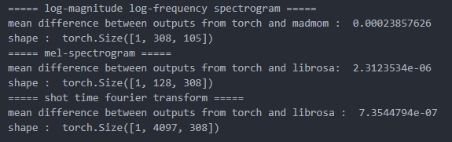

# pytorch Spectrogram

This repository has the source code for computing spectrogram with torch. When processing audio signals, it can be done quickly in batch processing.

## Spectrogram in `torch_spec.py`
* `STFT` : same with librosa.stft
* `MelSpectrogram` : same with librosa.feature.melspectrogram
* `LMLFSpectrogram` : same with madmom.spectorgram.LogarithmicFilteredSpectrogramProcessor

## Verification with packages
If you run `torch_spec.py`, you can see the result as shown below.
  

## Reference
* Jongwook Kim's https://github.com/jongwook/onsets-and-frames
* Prem Seetharaman's https://github.com/pseeth/pytorch-stft
* `madmom` : https://madmom.readthedocs.io/en/latest/index.html
* `librosa` : https://librosa.github.io/librosa/index.html
